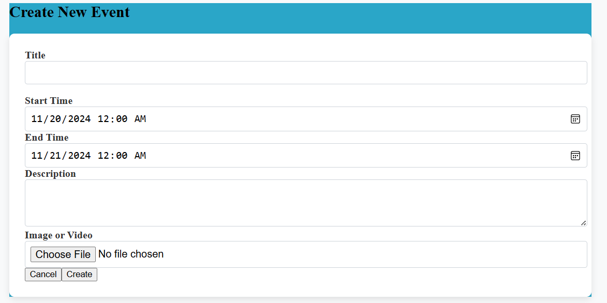
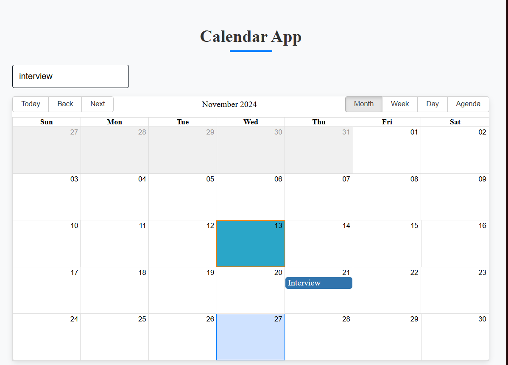

# Calendar App

A full-featured calendar application that allows users to create, view, edit, and delete events. Users can search for events, receive notifications for upcoming events, and upload attachments to their events. This project is built using Node.js, Express, MongoDB, and React with `react-big-calendar`.

## Table of Contents

- [About the Project](#about-the-project)
- [Features](#features)
- [Technologies Used](#technologies-used)
- [Installation](#installation)
- [Configuration](#configuration)
- [Usage](#usage)
- [API Documentation](#api-documentation)
- [Screenshots](#screenshots)
- [License](#license)

## About the Project

The Calendar App aims to provide users with a simple and intuitive interface to manage their events efficiently. It incorporates features such as real-time notifications, event searching, and file uploads for event attachments. The application is designed to be user-friendly and responsive, making it suitable for both desktop and mobile devices.

## Features

- **Create, Update, and Delete Events**: Allows users to manage their events through a streamlined interface.
- **Real-time Notifications**: Users receive notifications for upcoming events.
- **Search Functionality**: Users can search events by title or description.
- **Event Filtering**: The calendar displays only events from the current month, with special styling for today’s date.
- **File Attachments**: Users can upload and view attachments related to their events.

## Technologies Used

- **Frontend**: React, Tailwind CSS (optional), `react-big-calendar`, Moment.js
- **Backend**: Node.js, Express
- **Database**: MongoDB (using Mongoose for ORM)
- **Notifications**: Browser Notifications API

## Installation

Follow these steps to install and run the project locally.

### Prerequisites

Ensure you have the following installed:
- Node.js
- MongoDB
- npm (Node Package Manager)

### Cloning the Repository

```bash
git clone https://github.com/your-username/calendar-app.git
cd calendar-app
```

### Installing Dependencies

#### Server-side

Navigate to the `server` folder and install dependencies:

```bash
cd server
npm install
```

#### Client-side

Navigate to the `client` folder and install dependencies:

```bash
cd ../client
npm install
```

## Configuration

### Server Configuration

In the `server` folder, create a `.env` file to store your environment variables. Here is an example of the required variables:

```env
PORT=5000
MONGO_URI=your_mongodb_connection_string
```

### Starting the Server

```bash
node index.js
```

### Client Configuration

In the `client/src` folder, update the `api.js` file with the correct base URL for your API server.

```javascript
// api.js
const API_BASE_URL = 'http://localhost:5000/api/events';
```

### Starting the Client

In the `client` folder, start the React development server:

```bash
npm start
```

### Accessing the Application

The frontend should be available at [http://localhost:3000](http://localhost:3000) and the backend server at [http://localhost:5000](http://localhost:5000).

## Usage

- **To Create Events**: Click on a date in the calendar, fill out the event details, and submit.
- **To Edit or Delete Events**: Click on an existing event to open it, make any necessary changes, or delete the event.
- **Search Events**: Use the search bar to filter events based on keywords in the title or description.
- **File Uploads**: Attach files to events when creating or editing them.
- **Notifications**: Make sure your browser allows notifications from this application to receive reminders.

## API Documentation

### Endpoints

1. **GET /api/events**: Retrieve all events.
2. **POST /api/events**: Create a new event.
3. **PUT /api/events/:id**: Update an existing event.
4. **DELETE /api/events/:id**: Delete an event.

## Screenshots

1. **Main Calendar View**

   

2. **Event Creation Modal**

   

3. **Event Search**

   

4. **Notification Popup**

   

## License

This project is licensed under the MIT License.

---

Feel free to adapt this `README.md` based on any additional specifics of your project!